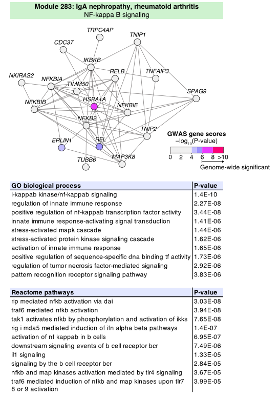

```{r setup, include=FALSE}
knitr::opts_chunk$set(echo = TRUE,
                      message=FALSE,
                      fig.path = "figures/",
                      dev = c('pdf','png'),
                      dpi = 300)
options(tinytex.verbose = TRUE)
```

# Introduction

`gerr` is an R package for gene-set enrichment with reguarlized regression.

We formulate the gene set enrichment problem within a regularized regression framework. 
Thus, the problem of gene-set enrichment is transformed into a feature 
selection problem, where the aim is to select the gene-sets that best predict
the membership of genes in a given set of genes of interest. 

We propose to apply regularized regression methods, such as lasso 
(l1 regularization),ridge (l2 regularization), or elastic net (a hybrid of 
l1 and l2 regularization controlled by the hyperparameter alpha), in order to
adjust the treatment of similar or redundant gene sets.

For more details about this method. Please refer to out manuscript on bioarxiv.

# Installation

`gerr` can be installed from Bioconductor:
```{r install, eval= FALSE}
if (!requireNamespace("BiocManager", quietly=TRUE)){
    install.packages("BiocManager")}
BiocManager::install("gerr")
```


The package can be loaded using the `library` command.

```{r load, eval=TRUE, message=FALSE} 
library(gerr)
```

To see the latest updates and releases or to post a bug, see our GitHub page 
at https://github.com/TaoDFang/gerr. 

To ask questions or post issues about `gerr`, plase create issures 
at https://github.com/TaoDFang/gerr/issues

# Gene module annotation or gene set enrichment analysis via regression based method 

To test a our method, we use a consensus module from the paper: 
Choobdar,S. et al. (2019) Open Community Challenge Reveals Molecular Network Modules with Key Roles in Diseases. bioRxiv, 265553.

This module is associated with IgAN and was identified using the consensus analysis in the InWeb 
protein-protein interaction network. The module consists of immune-related NF-$\kappa$B signaling pathways.

Figure below shows mannually extracted P-values for signficantly enriched pathways from GO Ontology and REACTOME database by using the non-central hypergeometric distribution test. 




Read non-central hypergeometric distribution test results from original paper  for gene module based on GO Ontology and REACTOME pathways

```{r Fisher}
hyperfile <- system.file("data_raw/Daniel_S5_mod283.txt", package="gerr")
hypergeometric_test_results=read.csv(file = hyperfile,
                                     header = TRUE,sep = "\t")
#filterd results with only P.noncentral value less then 0.05
isSig <- hypergeometric_test_results$P.noncentral<0.05
results_filtered=hypergeometric_test_results[isSig,]

head(results_filtered)
dim(results_filtered)
```

We found that the traditional non-central hypergeometric distribution test/fisher extact test 
usually returns a long list of over-presented pathways for certain gene module. Many of these pathways are either redundant or closely related. For example, herea are four pathways with p-values less than 0.05: 

* immune response-activating cell surface receptor signaling pathway (GO:0002429);
* immune response-activating signal transduction (GO:0002757);
* immune response-regulating cell surface receptor signaling pathway (GO:0002768);
* immune response-regulating signaling pathway (GO:0002764).

We note that [GO:0002757 and GO:0002768 are parents of GO:0002429, and GO:0002764 is parent of GO:0002757 and GO:0002768 ](https://www.ebi.ac.uk/QuickGO/term/GO:0002429)

To get a more sparse results by exploting corraltion between different pathways,
we could use the "regression_selected_pathways" function in `gerr` package.


This function use regularized regression methods to do enrichment analysis, 
more specifically, the elastic net model, a hybrid of l1 and l2 regularization controlled by the hyperparameter $\alpha$, in the current implementation in order to adjust the treatment of similar or redundant gene-sets. 

If two gene-sets are highly redundant, lasso will assign a higher coefficient 
to one of them randomly, ridge will assign equal coefficients to both of them,
whereas elastic net will behave between lasso and ridge.

To use this method, use need to provide a binary gene pathways realationships 
matrix whose columns are the pathways/gene sets and whose rows are all the genes 
from pathways/gene sets.For gene i and pathway j, the value of matrix(i,j) is 1 is gene i belonging to pathway j, otherwise 0.

Users could use default gene_pathway_matrix  so it will use pre-collected gene_pathway_matrix from GO Ontology and REACTOME databaase. Altertatively, Users could use their own customized gene_pathway_matrix.

The step below constructs a regularized linear regression model, using a pretrained lambda value `pretrained_gaussian_lambda`.

```{r enrichment}
#Gene module from the paper
gene_list=c("TRPC4AP","CDC37","TNIP1","IKBKB","NKIRAS2","NFKBIA","TIMM50","RELB",
            "TNFAIP3","NFKBIB","HSPA1A","NFKBIE","SPAG9",
            "NFKB2","ERLIN1","REL","TNIP2","TUBB6","MAP3K8")
#help("regression_selected_pathways")

#Here use regression_selected_pathways with default gene pathway matrix 
#and set the alpha value as 0.5
enrichment_results=regression_selected_pathways(gene_input=gene_list,
                                                gene_pathway_matrix=NULL,alpha=0.5, family="gaussian", 
                                                lambda=pretrained_gaussian_lambda)
enrichment_results$selected_pathways_names
```

A regularized binomial model can be alternatively constructed. Here is an example.

```{r binomialResults}
binomRes <- regression_selected_pathways(gene_input=gene_list,family="binomial",
                                gene_pathway_matrix=NULL,alpha=0.1,lambda=seq(0.001,0.1,0.001))
binomRes$selected_pathways_names
```

The results suggest that regularized regression returns a much more sparse while biological meaning results. It captures most important NF-kappaB signaling pathways from the gene module.

Currently, both `gaussian` (linear model) and `binomial` (logistic model) families are supported, with `gaussian` as the default parameter. See the vignette *comparing linear versus logistic regression with gerr* for more information about this.

# Other functions

```{r tree}
# If you use the default pathway databases(GO Ontologyand REACTOME).
# After you extracted enriched pathways, you can use find_root_ids function
#to find thier GO sub-root or REACTOME roots(ID) to help you better
#understanding the biological meanings of pathways.
#Here we use GO sub-root instead of GO root nodes as there are only 
#three roots in the GO ontology and there are not so specific 
GO_Reactome_root_id=find_root_ids(names(enrichment_results$selected_pathways_coef))
GO_Reactome_root_id

# Or if you want to obatain root notes names instead of ID, you can use function
# from_id2name to get names from ids
GO_Reactome_root_id_names=from_id2name(GO_Reactome_root_id)
GO_Reactome_root_id_names

# Or you  can use function get_steps function to calculate the distance from
#selected pathways to GO or Reactome roots
step2root=get_steps(names(enrichment_results$selected_pathways_coef))
step2root
# To view specic position of GO/REACOTEM pathways in ontology trees.
# You can use Visualization tool at https://www.ebi.ac.uk/QuickGO/ 
# and https://reactome.org/PathwayBrowser/ 
```

# A simulation study

```{r simulation, eval=FALSE}
go_list <- readRDS("~/Documents/DreamChallengeModuleAnnotation/HPC_Disease_module_identification_DREAM_change/go_list.rds")
go_list_names=as.character(from_id2name(names(go_list)))
go_list_ordered=go_list[order(go_list_names)]

#GO:0006958 complement activation, classical pathway, 
#GO:0030449 regulation of complement activation
#GO:0038095 Fc-epsilon receptor signaling pathway
a=go_list[["GO:0006958"]]
b=go_list[["GO:0030449"]]
c=go_list[["GO:0038095"]]

length(intersect(a,b))
length(intersect(a,c))
length(intersect(b,c))

enrichment_results=regression_selected_pathways(gene_input=c(a,b,c),
                                                gene_pathway_matrix=NULL,alpha=0.5)

enrichment_results

# miminal required genes for successful retreat

test=regression_selected_pathways(gene_input=c,
                                                gene_pathway_matrix=NULL,alpha=0.5)
test_ranks=c()
for(i in round((0.05*length(c))):length(c)){
    test=regression_selected_pathways(gene_input=c,
                                                gene_pathway_matrix=NULL,alpha=0.5)
    test_ranks=c(test_ranks,match("GO:0038095",names(test$selected_pathways_coef)))
}
```

# Session Information

```{r sessionInfo}
sessionInfo()
```
